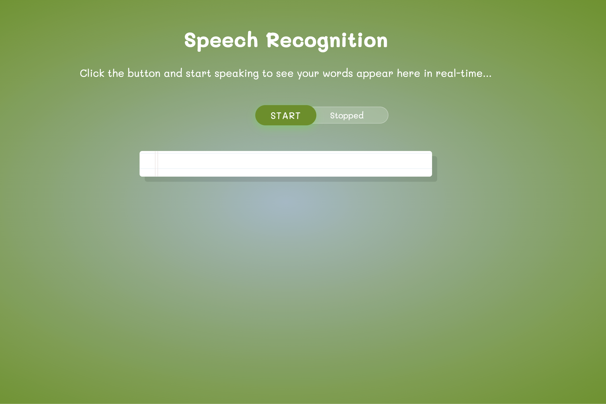

# Speech Recognition
A simple browser-based speech recognition app that transcribes your speech in real-time.

## Features

- Real-time speech-to-text transcription
- Continuous listening mode
- Voice commands:
  - Say **"stop"** to stop recording
  - Say **"clear"** to clear the transcript
  - Say **"What is the time"** to get the current time

## How to Use
1. Run `npm install` then `npm start`
1. Open `index.html` in your browser (Chrome or Edge recommended)
2. Click the **Start** button to begin recording
3. Start speaking and watch your words appear
4. Click or say **Stop** when done

## Requirements

- Modern web browser with Web Speech API support (Chrome, Edge, Safari)
- Microphone access